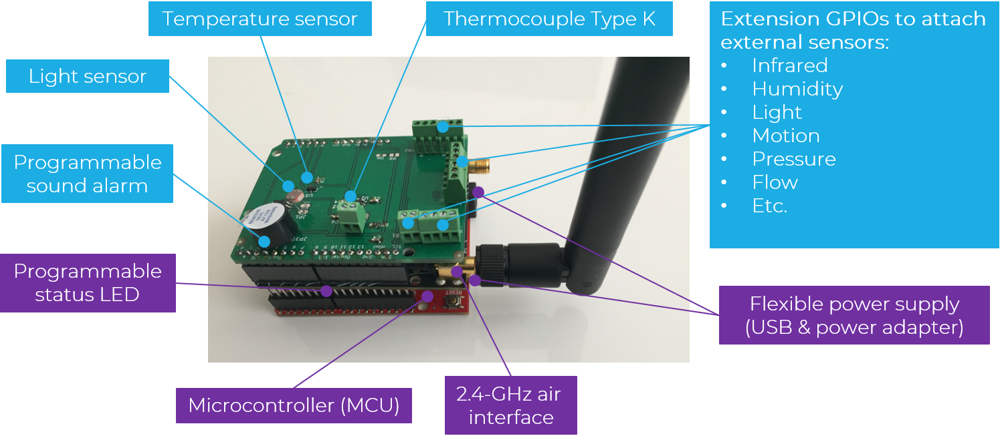
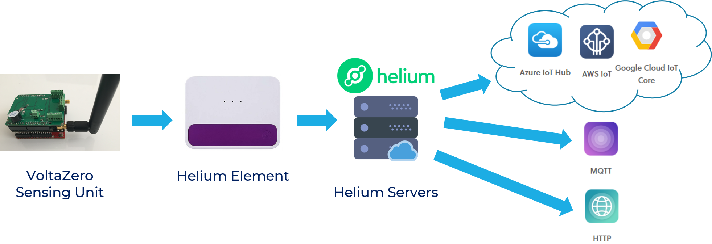

# VoltaZero Shield

VoltaZero is an Arduino Uno shield which encompasses a total of five onboard and external sensors. It was designed as part of the VoltaZero Sensing Unit (VSU) which combines a microcontroller (Arduino Uno), a connectivity means (Helium Atom/Element) and a sensing board (VoltaZero Shield). The primary usage of the shield is for environment control. However, it was designed with extensibility in mind. For this purpose, it supports external sensors through onboard built-in relays.

# VoltaZero Shield Unit

## VSU Capabilities

The VSU offers several features:
* Three built-in sensors
* Up to seven external sensors (supported through extension GPIOs), to accommodate a broad range of applications
* ISM-band radio air interface
* Embedded sound / visual alerts
* Flexible power supply
* Remote configuration
* Automatic recovery on network error

*VoltaZero Sensing Unit: A collection of sensors with MCU and connectivity*

## Sensors Pinout

| Sensor        | Pin           | Type  | Location  |
|:------------- |:------------- |:----- |:----- |
| Temperature sensor (t0) | A0 | IN | onboard |
| Temperature sensor (t1) | A1 | IN | external |
| Light sensor | A2 | IN | onboard |
| Extension relay (r1) | A3 | IN/OUT | external |
| Extension relay (r2) | A4 | IN/OUT | external |
| Active buzzer | D2 | OUT | onboard |

# Data Flow

The VSU is part of an end-to-end cloud-based Internet-of-Things solution. So, the main burden is to ensure the reliable and continuous communication of sensors data to the cloud. To do so, the MCU gets the sensors readings from the VoltaZero shield. It then sends that data to the Helium Element through the Helium Atom shield. Next, the Element transfers the data to the Helium servers which dispatch it to a preselected channel. 
There are three types of channels:
* Cloud provider: Google IoT Core, Azure Iot Hub, and AWS IoT Core
* MQTT broker
* HTTP endpoint

*The VSU uses Helium Atom and Element to send data to the cloud*

# Project Description

This project consists of implementing the MCU code which:
* Gets the readings from the onboard sensors
* Sends the data in JSON format to the MQTT broker
* Checks if the readings are in a predefined "normal" range
* Trigger sound / visual alerts if the readings are not nominal or the VSU fails to connect to the Helium Element

## Prerequisites

Both the Helium Atom and Element should be activated and setup using the user's dashboard in the Helium website. The appropriate channel should also be configured.

## Dependencies

This project depends on:

* [Arduino 1.8.9](https://www.arduino.cc/en/main/software) - The standard Arduino library
* [Helium Arduino](https://github.com/helium/helium-arduino) - The Helium library for Arduino

## Deployment

The deployment of this code is similar to the deployment of most Arduino codes. However, one should pay attention to the definitions in `config.h` file in order to correctly set up the VSU environment. 

## Built With

* [Arduino 1.8.9](https://www.arduino.cc/en/main/software) - The Arduino IDE
* [Helium Arduino](https://github.com/helium/helium-arduino) - The Helium library for Arduino

## Authors

* **S. Lafi** - *Initial work*
* **A. Elzayat** - *Tested and validated sensors' readings*

## License

This project is licensed under the MIT License - see the [LICENSE](LICENSE.md) file for details.

## Acknowledgments

* **A. Elzayat** - Design of the VoltaZero Shield and validation of sensors' readings.
